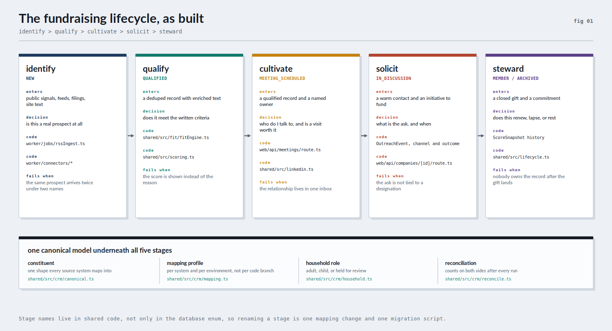
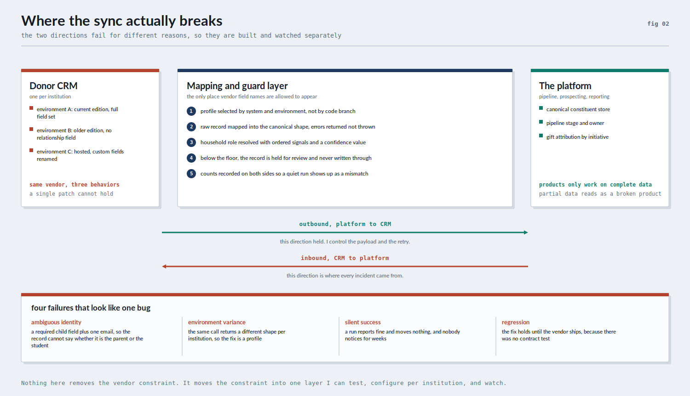

# Fundraising Lifecycle Platform

A pipeline and prospecting platform I designed and built at a national health nonprofit to run one
fundraising segment end to end: identify, qualify, cultivate, solicit, steward.

I built it because the segment was stalled and the reason was not donor willingness. It was that
nobody could see the pipeline. Prospect research sat in spreadsheets and inboxes, donor records sat
in the CRM, and the two never met. Sixty days after the first customer conversation the platform was
deployed. The write up below covers the approach, the tradeoffs, the code, and the numbers.

This repository is a working monorepo, not a deck. The product documents point at the files that
implement them.

## The unmet need

The school and youth segment produced less than one percent of the organization's overall fundraising
goal. Under two million dollars in total, from roughly thirty schools. Meanwhile the organization ran
national initiatives raising many multiples of that, and the school segment was where the next
generation of donors and volunteers actually started.

Three things were true at once:

1. Nobody could answer "who should we be talking to next" without a person spending a week on it.
2. The systems of record were not designed for this segment. Records arrived through a donor CRM
   built around households and constituents, and a school contact does not fit that shape cleanly.
3. Adoption was the binding constraint. A two person advancement office was not going to log into a
   second system unless it saved them time the same week.

So the problem was never a reporting problem. It was a data movement and identity problem wearing a
reporting problem's clothes.

## What I built

Five stages, one canonical record underneath them, and a mapping layer that is the only place vendor
field names are allowed to appear.



- **Identify.** A background worker pulls public signals on a schedule, enriches each candidate from
  its own site text, and deduplicates before anything reaches a human.
- **Qualify.** A written criteria engine returns a tier and the reasons for it. The interface shows
  the reasons, not the score, which is the single change that got fundraisers to trust it.
- **Cultivate.** Contact discovery, meeting scheduling, and an owner on every record, so a regional
  visit could be justified against something other than a hunch.
- **Solicit.** Outreach events with a channel and an outcome, and every ask tied to a designation so
  giving could be attributed to a named initiative.
- **Steward.** Stage history and score snapshots over time, so renewal and lapse were visible instead
  of discovered.

Read [docs/lifecycle-model.md](docs/lifecycle-model.md) for what enters and exits each stage, and
[docs/functional-requirements.md](docs/functional-requirements.md) for the numbered requirements and
acceptance criteria an engineer worked from.

## The integration problem, which is the real problem

Everything above depends on data arriving from a donor CRM, and that is where the work actually was.
The failures were not random. They had four shapes, and they needed four different answers.



Outbound to the CRM held, because I controlled the payload, the retry, and the schedule. Inbound was
where every incident came from. A constituent profile could require a child's school name and an
email address, which means an inbound record cannot reliably tell you whether it describes the adult
in the household or the child. That is an entity resolution problem created by how the source
structures its fields, not a transport problem, and no amount of retry logic fixes it.

What I did about it:

- Wrote the canonical constituent model first, then treated every source system as a mapping into it.
  Vendor field names never spread past one directory.
- Resolved household role with ordered signals and a confidence value instead of guessing. Below the
  confidence floor a record is held for review and never written through to a system of record.
- Treated inbound and outbound as separate products with separate contracts, separate tests, and
  separate alerting, because they fail for different reasons.
- Selected a mapping profile per institution and per environment, so an older edition with a missing
  relationship field is a configuration entry rather than a code branch.
- Recorded counts on both sides after every run, so a run that reports success and moves nothing
  shows up as a count mismatch instead of a support ticket six weeks later.

[docs/integration-reliability.md](docs/integration-reliability.md) is the long version, including the
failure catalogue and what I would build first if I were starting on this problem again tomorrow.

## Outcomes

- Shipped in about sixty days, first conversation to deployed product.
- Deployed to roughly fourteen schools.
- Eighty thousand dollars in new giving in the six months after launch, from net new donors
  attributed to prospecting and tied to named strategic initiatives.
- Prospect research stopped being a weekly manual exercise across the team. The recurring cost of
  running the platform was a hosting bill and two paid data feeds, which came in well under the
  quoted annual price of a single commercial prospect research seat.

The honest framing: eighty thousand dollars is not a large number against a national fundraising
goal. It mattered because it came from a segment that had produced almost nothing, it was attributable,
and it was produced by fourteen schools rather than thirty, which made the per school economics
arguable for the first time.

## Who the customers were

- School advancement staff, often one or two people who also run events and communications.
- The organization's school engagement staff, who owned the relationships.
- Regional fundraising staff, who needed a defensible reason to spend a campus visit on one school
  and not another.
- The donor data and CRM team, who owned the record of truth and had a legitimate objection to any
  new system writing into it. That objection is why the review queue exists.
- Strategic initiative owners, who needed giving attributed to their initiative.

## Code

```
apps/web        Next.js 14 App Router, TypeScript, Tailwind, API routes
apps/worker     BullMQ worker, scheduled ingestion, connectors, enrichment
packages/db     Prisma schema, migrations, seed
packages/shared types, scoring, criteria engine, lifecycle model, CRM mapping layer
```

The parts worth reading first:

| What | Where |
| --- | --- |
| Canonical five stage model and stage transition rules | `packages/shared/src/lifecycle.ts` |
| Canonical constituent and gift shapes | `packages/shared/src/crm/canonical.ts` |
| Per system and per environment mapping profiles | `packages/shared/src/crm/mapping.ts` |
| Household role resolution and the review queue rule | `packages/shared/src/crm/household.ts` |
| Directional reconciliation and silent failure detection | `packages/shared/src/crm/reconcile.ts` |
| Written criteria engine and tiering | `packages/shared/src/fit/fitEngine.ts` |
| Scoring with configurable weights and thresholds | `packages/shared/src/scoring.ts` |
| Ingestion pipeline and connectors | `apps/worker/src/jobs/enrichmentPipeline.ts`, `apps/worker/src/connectors/` |
| Data model | `packages/db/prisma/schema.prisma` |
| Tests | `packages/shared/tests/`, `apps/worker/tests/` |

Setup and deployment notes are in [docs/ops/](docs/ops/).

## Documents

| File | Contents |
| --- | --- |
| [docs/case-study.md](docs/case-study.md) | The 0 to 1 account: the questions I asked, the tradeoffs I made, what I cut, how I worked with engineering and the fundraising teams |
| [docs/integration-reliability.md](docs/integration-reliability.md) | The donor CRM failure catalogue, the guard layer, monitoring, and what I would build first now |
| [docs/lifecycle-model.md](docs/lifecycle-model.md) | The five stages, stage by stage, mapped to the schema and the code |
| [docs/functional-requirements.md](docs/functional-requirements.md) | Numbered requirements with acceptance criteria and the file that satisfies each one |
| [docs/role-alignment.md](docs/role-alignment.md) | How this maps to a role owning data and integrations, including what I have not done |

## Why this is in my portfolio

I keep coming back to the same class of problem: a mission that depends on data arriving correctly
from systems I do not control. This repository is the smallest complete example of how I work on it.
Start with the canonical model, put the vendor mess in one testable layer, refuse to write through a
record you cannot vouch for, and measure the thing that actually moves.
